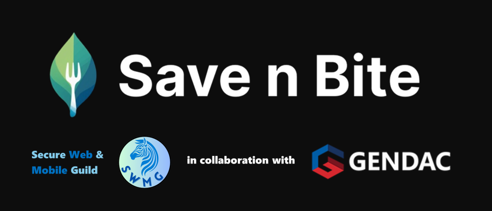
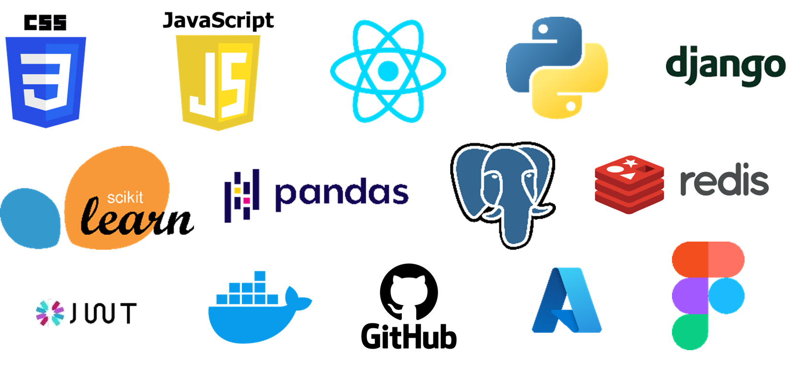

## *"Reducing Food Waste Through Technology"* 🍎♻️

---

<div align="center">

[](https://github.com/COS301-SE-2025/Save-n-Bite/actions)
[](https://coveralls.io/github/COS301-SE-2025/Save-n-Bite?branch=main)
[](https://github.com/COS301-SE-2025/Save-n-Bite/issues)

[](https://github.com/COS301-SE-2025/Save-n-Bite/commits)
[](https://github.com/COS301-SE-2025/Save-n-Bite)
[](https://github.com/COS301-SE-2025/Save-n-Bite/pulls)

[](https://github.com/COS301-SE-2025/Save-n-Bite)
[](https://github.com/COS301-SE-2025/Save-n-Bite)
[](https://github.com/COS301-SE-2025/Save-n-Bite/graphs/contributors)

[](https://github.com/COS301-SE-2025/Save-n-Bite/commits)

</div>

## 📌 Project Description
**Save n Bite** is a digital platform connecting commercial food providers with individuals and organizations in need with the goal of combating food waste and hunger in South Africa using technology-driven solutions and community collaboration.✊

Key features:  
- **AI-driven surplus prediction** for optimal food redistribution.  
- **Real-time inventory** and **secure verification** for users/businesses.  
- **Gamification** through rewards for donors and a digital garden for users.  
- **Impact dashboard** tracking meals saved and CO₂ reduction.  

**Pilot Phase:** Launching at the University of Pretoria.  

---

## 🛠️ Tech Stack
<div align="center">

<table>
  <thead>
    <tr>
      <th style="text-align: center;">Category</th>
      <th style="text-align: center;">Technologies</th>
    </tr>
  </thead>
  <tbody>
    <tr>
      <td style="text-align: center;"><strong>Frontend</strong></td>
      <td style="text-align: center;">
        
      </td>
    </tr>
    <tr>
      <td style="text-align: center;"><strong>Backend</strong></td>
      <td style="text-align: center;">
        
        
        
      </td>
    </tr>
    <tr>
      <td style="text-align: center;"><strong>Database</strong></td>
      <td style="text-align: center;">
        
        
      </td>
    </tr>
    <tr>
      <td style="text-align: center;"><strong>Cloud</strong></td>
      <td style="text-align: center;">
        
      </td>
    </tr>
    <tr>
      <td style="text-align: center;"><strong>DevOps</strong></td>
      <td style="text-align: center;">
        
        
      </td>
    </tr>
    <tr>
      <td style="text-align: center;"><strong>AI/ML</strong></td>
      <td style="text-align: center;">
        
        
        
      </td>
    </tr>
  </tbody>
</table>

</div>




---

## 📂 Repository Structure

```text
main
│
├── dev
│   ├── backend
│   │   ├── feature/...
│   │   └── hotfix/...
│   └── frontend
│       ├── feature/...
│       └── hotfix/...
```
---

---

## 👥 Team Members
| Profile               | Name                  | Role                | LinkedIn                                      | GitHub                                   |
|-----------------------|-----------------------|---------------------|-----------------------------------------------|------------------------------------------|
|  | Sabrina-Gabriel Freeman | Project Manager, System Architect, Data Engineer | [](https://www.linkedin.com/in/sabrina-gabriel-freeman-a57281346) | [](https://github.com/SaberF24) |
|  | Marco Geral | Lead Services & Testing Engineer, DevOps | [](https://www.linkedin.com/in/marco-geral-820b7a355/) | [](https://github.com/Marco-Geral) |
|  | Chisom Emekpo | Integration & Testing Engineer | [](https://www.linkedin.com/in/chisom-emekpo-39b89827l/) | [](https://github.com/somworld6) |
|  | Vané Abrams | Business Analyst, UI Engineer | [](http://www.linkedin.com/in/vane-abrams–40569b305) | [](https://github.com/vdenise20) |
|  | Capleton Chapfika | Lead Integration Engineer, DevOps | [](https://www.linkedin.com/in/capletonchapfika/) | [](https://github.com/Capleton11) |

---

## ✅ Demo 2 Deliverables (27 June 2025)
1. **Implemented Use Cases:**
   - User registration/login (JWT/OAuth2).    
   - User themes and profile preferences (React + PostgreSQL).
   - Validation of user input (React + Django validators).
   - Food listing by businesses (React, Django + Redis).
   - Browsing food listings (React + Django API, Redis).
   - Purchase/Request food (React + Django REST, PostgreSQL).

2. **SRS Document**:
   **📄 [Software Requirements Specification (SRS)](documentation/SRS.md)**  
   - Introduction
   - User stories
   - Use Case Diagrams
   - Functional Requirements
   - Service Contracts
   - Domain Model
   - Architectural Requirements
   - Technology Requirements


4. **GitHub Hygiene**:  
We follow a GitFlow-inspired branching strategy to maintain clean and organized version control. The *main* branch holds production-ready code, while all active development takes place in the *dev* branch. From dev, we maintain separate long-lived backend and frontend branches to isolate concerns. Features are developed in *feature/* branches branched off their respective areas, and urgent fixes are handled in *hotfix/* branches. All changes are merged via pull requests with code reviews to ensure stability, consistency, and collaboration across the team.

5. **GitHub Project Board**:
   - **📊 [GitHub Project Board](https://github.com/orgs/COS301-SE-2025/projects/177/views/2)**  

6. **Demo 2 Video**
   [Click here!](https://www.canva.com/design/DAGowUskyDY/E8nYEYzEWrMe1D13DkMVFw/watch?utm_content=DAGowUskyDY&utm_campaign=designshare&utm_medium=link2&utm_source=uniquelinks&utlId=h3390ca1771)

---

## ✅ Demo 1 Deliverables (28 May 2025)
1. **Implemented Use Cases:**
   - User registration/login (JWT/OAuth2).    
   - User themes and profile preferences (React + PostgreSQL).
   - Validation of user input (React + Django validators).
   - Food listing by businesses (React, Django + Redis).
   - Browsing food listings (React + Django API, Redis).
   - Purchase/Request food (React + Django REST, PostgreSQL).

2. **SRS Document**:
   **📄 [Software Requirements Specification (SRS)](documentation/SRS.md)**  
   - Introduction
   - User stories
   - Use Case Diagrams
   - Functional Requirements
   - Service Contracts
   - Domain Model
   - Architectural Requirements
   - Technology Requirements


4. **GitHub Hygiene**:  
We follow a GitFlow-inspired branching strategy to maintain clean and organized version control. The *main* branch holds production-ready code, while all active development takes place in the *dev* branch. From dev, we maintain separate long-lived backend and frontend branches to isolate concerns. Features are developed in *feature/* branches branched off their respective areas, and urgent fixes are handled in *hotfix/* branches. All changes are merged via pull requests with code reviews to ensure stability, consistency, and collaboration across the team.

5. **GitHub Project Board**:
   - **📊 [GitHub Project Board](https://github.com/orgs/COS301-SE-2025/projects/177/views/2)**  

6. **Demo 1 Video**
   [Click here!](https://www.canva.com/design/DAGowUskyDY/E8nYEYzEWrMe1D13DkMVFw/watch?utm_content=DAGowUskyDY&utm_campaign=designshare&utm_medium=link2&utm_source=uniquelinks&utlId=h3390ca1771)

---

## 📫 Contact Us
 [](mailto:swmguild@gmail.com)

