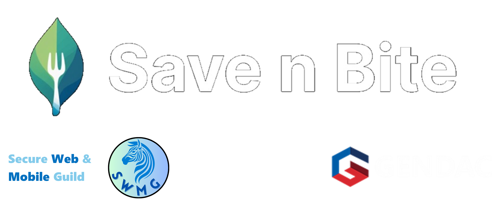

# Save n Bite - Reducing Food Waste Through Technology 🍎♻️

---

## 📌 Project Description
**Save n Bite** is a digital platform connecting commercial food providers with individuals and organizations in need with the goal of combating food waste and hunger in South Africa using technology-driven solutions and community collaboration.✊

Key features:  
- **AI-driven surplus prediction** for optimal food redistribution.  
- **Real-time inventory** and **secure verification** for users/businesses.  
- **Gamification** through rewards for donors and a digital garden for users.  
- **Impact dashboard** tracking meals saved and CO₂ reduction.  

**Pilot Phase:** Launching at the University of Pretoria.  

---

## 🛠️ Tech Stack
| Category       | Technologies                                                                 |
|----------------|-----------------------------------------------------------------------------|
| **Frontend**   | React, Material UI |
| **Backend**    | Django, Django REST, JWT|
| **Database**   | PostgreSQL, Redis|
| **Cloud**      | Microsoft Azure |
| **DevOps**     | Docker, GitHub Actions |
| **AI/ML**      | Python, Scikit-learn, Pandas |

---

## 📂 Repository Structure
    main
    |_dev
      |_frontend
         |_frontend features
      |_backend
         |_backend features

---

## 🔗 Documentation
- **📄 [Software Requirements Specification (SRS)](documentation/SRS.md)**
- **📊 [GitHub Project Board](https://github.com/orgs/COS301-SE-2025/projects/177/views/2)**  

---

## 👥 Team Members
| Profile               | Name                  | Role                | LinkedIn                                      | GitHub                                   |
|-----------------------|-----------------------|---------------------|-----------------------------------------------|------------------------------------------|
|  | Sabrina-Gabriel Freeman | Project Manager, System Architect, Data Engineer |  |  |
|  | Marco Geral | Lead Services & Testing Engineer, DevOps |  |  |
|  | Chisom Emekpo | Integration & Testing Engineer |  |  |
|  | Vané Abrams | Business Analyst, UI Engineer |  |  |
|  | Capleton Chapfika | Lead Integration Engineer, DevOps |  |  |

---

## ✅ Demo 1 Deliverables (28 May 2025)
1. **Implemented Use Cases:**
   - User registration/login (JWT/OAuth2).    
   - User themes and profile preferences (React + PostgreSQL).
   - Validation of user input (React + Django validators).
   - Food listing by businesses (React, Django + Redis).
   - Browsing food listings (React + Django API, Redis).
   - Purchase/Request food (React + Django REST, PostgreSQL).

2. **SRS Document**:  
   - Introduction
   - User stories
   - Use Case Diagrams
   - Functional Requirements
   - Service Contracts
   - Domain Model
   - Architectural Requirements
   - Technology Requirements

3. **GitHub Hygiene**:  
   - Branching strategy: GitFlow (`main` ↔ `dev` ↔ `subsystem/` ↔ `feature/` branches).  
   
   
   

---

## 📫 Contact Us
 

