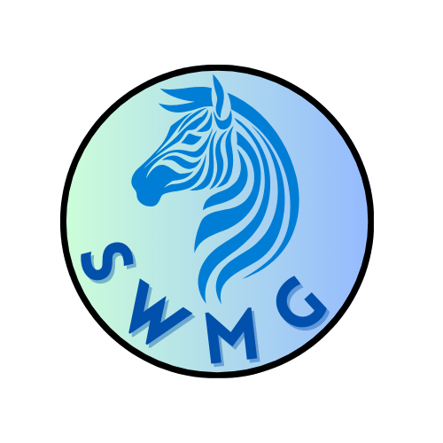

# Save n Bite - Reducing Food Waste Through Technology 🍎♻️

**Secure Web & Mobile Guild (SWMG)**  
**University of Pretoria | COS 301 - Software Engineering Capstone (2025)**  

  

---

## 📌 Project Description
**Save n Bite** is a digital platform connecting commercial food providers with individuals and organizations in need to reduce food waste and hunger in South Africa 🇿🇦.  
Key features:  
- **AI-driven surplus prediction** for optimal food redistribution.  
- **Real-time inventory** and **secure verification** for users/businesses.  
- **Gamification** through rewards for donors and a digital garden for users.  
- **Impact dashboard** tracking meals saved and CO₂ reduction.  

**Pilot Phase:** Launching at the University of Pretoria.  

---

## 🛠️ Tech Stack
| Category       | Technologies                                                                 |
|----------------|-----------------------------------------------------------------------------|
| **Frontend**   |     |
| **Backend**    |    |
| **Database**   |   |
| **Cloud**      |  |
| **DevOps**     |     |
| **AI/ML**      |    |

---

## 📂 Repository Structure
    TBC

---

## 🔗 Documentation
- **📄 [Software Requirements Specification (SRS)](documentation/SRS.md)**
- **📊 [GitHub Project Board](https://https://github.com/orgs/COS301-SE-2025/projects/177)**  
- **🤖 [API Documentation](documentation/construction.png)**  

---

## 👥 Team Members
| Name                  | Role                | LinkedIn                                      | GitHub                                   |
|-----------------------|---------------------|-----------------------------------------------|------------------------------------------|
| Sabrina-Gabriel Freeman | Project Manager, System Architect, Data Engineer |  |  |
| Marco Geral           | Lead Services/Testing Engineer, DevOps |  |  |
| Chisom Emekpo         | Integration & Testing Engineer |  |  |
| Vané Abrams           | Business Analyst, UI Engineer |  |  |
| Capleton Chapfika     | Lead Integration Engineer, DevOps |  |  |

---

## ✅ Demo 1 Deliverables (28 May 2025)
1. **Implemented Use Cases** (3+):  
   - User registration/login (JWT/OAuth2).  
   - Food listing by businesses (Django API + React form).  
   - Basic purchase/donation flow (mock payments).  

2. **SRS Document**:  
   - Domain model (UML class diagram).  
   - Use case diagrams + functional requirements.  

3. **GitHub Hygiene**:  
   - Branching strategy (`main` ↔ `feature/` branches).  
   - Code quality badges (Coveralls, GitHub Actions).  

---

## 🚀 Getting Started
[TBC](assets/construction.png)