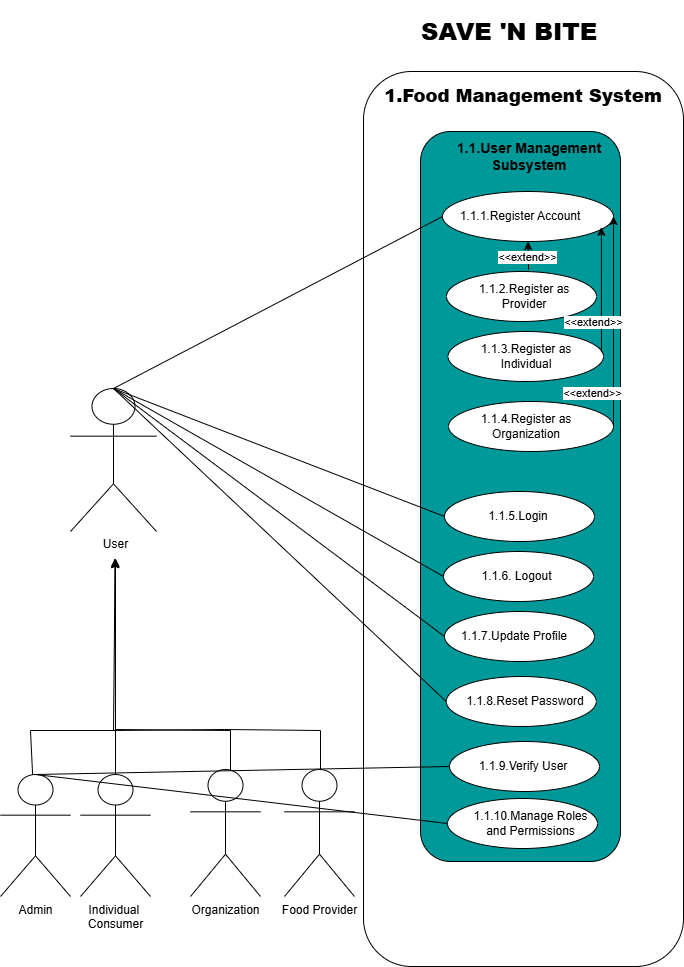
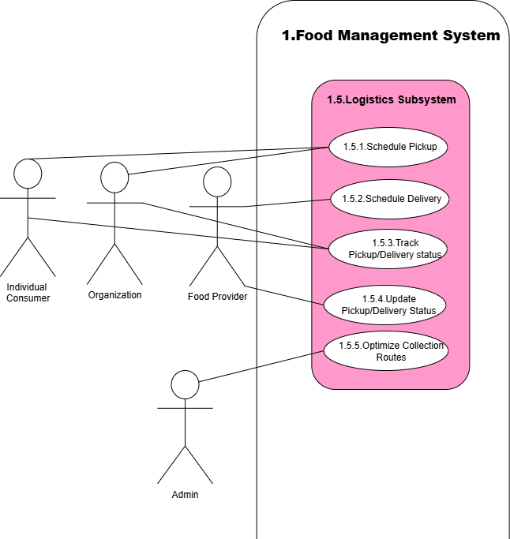

# Software Requirements Specification (SRS)  
**Project Name:** Save n Bite  
**Version:** 2.0  
**Date:** [25/06/2025]  
**Team:** [Secure Web & Mobile Guild]  
**GitHub Repository:** [Link to Repo](https://github.com/COS301-SE-2025/Save-n-Bite)

---

## 1. Introduction  

### Business Need  
Food waste is a major global concern, with tons of surplus food being discarded every day despite being safe for consumption. This not only contributes to environmental harm but also overlooks the needs of food-insecure individuals and communities. Businesses such as restaurants, hotels, and grocery stores frequently dispose of edible surplus food due to logistical and regulatory constraints.  

Simultaneously, many individuals—especially students and low-income groups—face food insecurity. There is a need for a structured, secure, and accessible platform that facilitates the redistribution of surplus food in a way that is efficient, compliant with safety regulations, and scalable across communities.  

### Project Scope  
Save n Bite will develop a web and mobile platform that connects food suppliers with individuals and organisations in need. The system will allow verified users to list, browse, request, purchase, or request a donation of surplus food. It includes:  
- Role-based dashboards  
- Scheduling tools for pickups  
- AI-driven listing suggestions  
- Review features  

**Exclusions:**  
- Delivery and logistics are **not** part of this project.  

**Pilot Program:**  
The project will be piloted with **University of Pretoria food outlets** in collaboration with **Gendac**.  

---

## 2. User Stories / Epics 

### EPIC 1: User Profile Management  

| User Stories | Acceptance Criteria |
|-------------|--------------------|
| **1. As a Food Provider**, I want to register a profile so that I can list surplus food items for sale or donation. | Given that a user wants to register as a Food Provider, when they select "Register as Food Provider" and enter business details, contact information, and license documents, then a confirmation of successful registration is received. |
| **2. As an Individual Consumer**, I want to register an account so that I can browse and purchase food. | Given that an Individual Consumer wants to register an account, when they choose "Register as Individual" and provide their name, email, and password, then a confirmation email is sent upon successful registration. |
| **3. As an Organization**, I want to register to request food donations for our cause. | Given that an Organization wants to register for food donation requests, when they select "Register as Organization" and upload proof of registration, then their status is set to "Verification pending" until approved by an admin. |
| **4. As a System Administrator**, I want to verify user accounts so that only legitimate providers and organizations are approved. | Given that a System Administrator wants to verify user accounts, when they access the admin dashboard and review uploaded documents, then they can approve or reject users with comments. |
| **5. As any User**, I want to update my profile information so that I can keep my data current. | Given that a user wants to update their profile information, when they edit fields such as email, phone, profile image, and upload updated documents, then their profile information is updated accordingly. |
| **6. As a System Administrator**, I want to manage user roles and permissions so that appropriate access is granted to each user type. | Given that a System Administrator wants to manage user roles and permissions, when they access role management features, then they can assign roles and restrict access based on the selected role. |

### EPIC 2: Food Listing and Management  

| User Stories | Acceptance Criteria |
|-------------|--------------------|
| **1. As a Food Provider**, I want to create a food listing so that surplus food can be made available. | Given that a Food Provider wants to list surplus food, when they enter the food name, description, expiration date, and optionally upload images and choose a pickup/delivery method, then the food listing is created as either a donation or discount item. |
| **2. As a Food Provider**, I want to receive AI-based listing suggestions so that I can optimize sales and reduce waste. | Given that a Food Provider is creating or updating a listing, when they input relevant details, then the system suggests optimal listing time and quantity based on historical data. |
| **3. As a Food Provider**, I want to view and manage my own listings so that I can update or remove them as needed. | Given that a Food Provider wants to manage existing listings, when they access their dashboard, then they can view, edit, or delete current and past food items. |

### EPIC 3: Food Discovery  

| User Stories | Acceptance Criteria |
|-------------|--------------------|
| **1. As an Individual Consumer**, I want to search for food items so that I can find meals that meet my needs. | Given that an Individual Consumer is searching for food, when they use the search bar and apply filters by name, type, expiration date, or location, then relevant food items are displayed. |
| **2. As an Organization**, I want to browse food listings so that I can find donations suitable for our needs. | Given that an Organization is browsing for food donations, when they filter listings by type, quantity, or expiration date, then donation-only items relevant to their needs are shown. |
| **3. As any User**, I want to view food details so that I can make informed decisions. | Given that any User is viewing a food listing, when they select an item, then the full details including description, images, listing date, and provider details are visible. |
| **4. As any User**, I want to receive notifications about new listings so that I can act quickly. | Given that any User has enabled notifications, when new listings that match their preferences (e.g., category or area) are posted, then they receive email or in-app alerts. |

### EPIC 4: Transactions & Donations 

| User Stories | Acceptance Criteria |
|-------------|--------------------|
| **1. As an Individual Consumer**, I want to purchase discounted food items so that I can reduce my food cost. | Given that an Individual Consumer is ready to make a purchase, when they proceed to checkout and complete the payment, then they can review their final order before payment confirmation. |
| **2. As an Organization**, I want to request food donations so that we can support those in need. | Given that an Organization wants to request a donation, when they submit a request for a specific donation listing, then they receive confirmation and available delivery options. |
| **3. As any User**, I want to view my transaction history so that I can track my past activities. | Given that any User wants to review their past transactions, when they access their transaction history, then they can filter by date and type (purchase/donation) and view order details and statuses. |

### EPIC 5: Pickup Coordination

| User Stories | Acceptance Criteria |
|-------------|--------------------|
| **1. As an Individual Consumer**, I want to schedule a pickup so that I can collect food at a convenient time. | Given that an Individual Consumer is finalizing a request or purchase, when they select a pickup time slot, then they receive pickup location, contact information, and a confirmation/reminder notification. |
| **2. As a Food Provider**, I want to manage pickup schedules so that I can prepare the food ahead of collection times. | Given that a Food Provider wants to prepare for pickups, when they define pickup windows and view the upcoming schedule, then they can manage pickups and mark them as completed when done. |
| **3. As a System Administrator**, I want to view and monitor all scheduled pickups so that I can ensure operations run smoothly. | Given that a System Administrator wants to monitor pickup activities, when they view the admin dashboard, then they can see all pickups, filter by user or time, and edit pickup times if needed. |

### EPIC 6: Feedback & Reviews

| User Stories | Acceptance Criteria |
|-------------|--------------------|
| **1. As an Individual Consumer**, I want to rate my purchase experience so that I can give feedback. | Given that an Individual Consumer has completed a transaction, when they leave a review with a rating and optional comment, then the review is linked to the specific transaction. |
| **2. As a System Administrator**, I want to moderate reviews so that we ensure quality content. | Given that a System Administrator wants to moderate user feedback, when they access the reviews section in the dashboard, then they can remove or flag inappropriate content. |

### EPIC 7: Analytics & Impact Tracking

| User Stories | Acceptance Criteria |
|-------------|--------------------|
| **1. As a Food Provider**, I want to view waste reduction metrics so that I can measure our sustainability efforts. | Given that a Food Provider wants to assess their environmental contribution, when they view analytics, then they see metrics such as food saved and CO₂ reduction over time (monthly/yearly). |
| **2. As an Organisation**, I want to track meals received and distributed so that we can report impact to donors. | Given that an Organization needs to track its operational impact, when they access reports, then they see visual charts of meals received and can export the data for reporting purposes. |

### EPIC 8: Blockchain & Rewards System

| User Stories | Acceptance Criteria |
|-------------|--------------------|
| **1. As an Individual Consumer**, I want to earn SaveCoins for sustainable actions so that I feel rewarded | Given that an Individual Consumer performs sustainable actions (e.g., donations or purchases), when the action is completed, then SaveCoins are automatically awarded and the balance updates in real-time. |
| **2. As an Organisation**, I want to redeem rewards so that we can access useful resources or discounts. | Given that an Organization has accumulated SaveCoins, when they view the reward catalog, then they can redeem coins for eligible resources or discounts. |

### EPIC 9: Education & Community

| User Stories | Acceptance Criteria |
|-------------|--------------------|
| **1. As any User**, I want to view sustainability content so that I can learn how to reduce food waste. | Given that any User wants to learn about sustainability, when they browse the education section, then they can view articles, videos, infographics, and track completed content. |
| **2. As an Individual Consumer**, I want to participate in challenges so that I can stay motivated. | Given that an Individual Consumer wants to stay motivated, when they join a sustainability challenge, then they receive progress updates and badges as they complete activities. |

### EPIC 10: Gamification

| User Stories | Acceptance Criteria |
|-------------|--------------------|
| **1. As a Food Provider**,  I want to earn points for listing items regularly so that I feel recognized. | Given that a Food Provider lists items regularly, when new listings or transactions are completed, then points are awarded and progress toward achievements is visible. |
| **2. As any User**, I want to view a leaderboard so that I can compare my sustainability impact with others. | Given that any User wants to track their standing, when they view the leaderboard, then they see rankings categorized by user type (individuals, providers, organizations) with weekly and monthly summaries. |

---

## 3. Use Case Diagrams

### 3.1 User Management Subsystem


---

### 3.2 Food Listings Subsystem


---

### 3.3 Food Discovery and Transactions


---

### 3.4 Feedback/Reviews, Analytics, and AI Subsystem


---

### 3.5 Logistics Subsystem


---

### 3.6 Blockchain, Education, and Gamification


---

## 4. Functional Requirements  

R1: **User Management**  
&nbsp;&nbsp;&nbsp;&nbsp;R1.1 The system must support registration for individuals, organisations, and businesses.  
&nbsp;&nbsp;&nbsp;&nbsp;R1.2 Users must be verified during registration.  
&nbsp;&nbsp;&nbsp;&nbsp;R1.3 The system must support role-based access (e.g. individuals, organisations, businesses, admin).  
&nbsp;&nbsp;&nbsp;&nbsp;R1.4 Secure login/logout functionality must be provided.  
&nbsp;&nbsp;&nbsp;&nbsp;R1.5 The system must limit functionality based on user role and verification status.  
&nbsp;&nbsp;&nbsp;&nbsp;R1.6 The system should allow the user to update their profile.  
&nbsp;&nbsp;&nbsp;&nbsp;R1.7 The system should allow the user to reset their password.  
&nbsp;&nbsp;&nbsp;&nbsp;R1.8 The admin should be able to manage roles and permissions.  

R2: **Make Listings**  
&nbsp;&nbsp;&nbsp;&nbsp;R2.1 Only verified business users should be able to create new surplus food listings.  
&nbsp;&nbsp;&nbsp;&nbsp;R2.2 Each listing must include the following details:  
&nbsp;&nbsp;&nbsp;&nbsp;&nbsp;&nbsp;&nbsp;&nbsp;- Name of the item  
&nbsp;&nbsp;&nbsp;&nbsp;&nbsp;&nbsp;&nbsp;&nbsp;- Description  
&nbsp;&nbsp;&nbsp;&nbsp;&nbsp;&nbsp;&nbsp;&nbsp;- Expiry date  
&nbsp;&nbsp;&nbsp;&nbsp;&nbsp;&nbsp;&nbsp;&nbsp;- Photos (optional)  
&nbsp;&nbsp;&nbsp;&nbsp;&nbsp;&nbsp;&nbsp;&nbsp;- Quantity available  
&nbsp;&nbsp;&nbsp;&nbsp;&nbsp;&nbsp;&nbsp;&nbsp;- Price (or mark as donation)  
&nbsp;&nbsp;&nbsp;&nbsp;&nbsp;&nbsp;&nbsp;&nbsp;- Pickup Options  
&nbsp;&nbsp;&nbsp;&nbsp;R2.3 Business users should be able to indicate whether the listing is for sale at a discounted price or available as a donation.  
&nbsp;&nbsp;&nbsp;&nbsp;R2.4 Listings should update real-time availability as items are reserved or claimed.  
&nbsp;&nbsp;&nbsp;&nbsp;R2.5 Businesses should be able to update food listings.  
&nbsp;&nbsp;&nbsp;&nbsp;R2.6 Businesses should be able to view their own listings.  

R3: **Browse Listings**  
&nbsp;&nbsp;&nbsp;&nbsp;R3.1 Verified users (individuals and organizations) should be able to view active food listings.  
&nbsp;&nbsp;&nbsp;&nbsp;R3.2 Users should be able to search for listings by keyword (e.g., name, category).  
&nbsp;&nbsp;&nbsp;&nbsp;R3.3 Users should be able to filter listings by:  
&nbsp;&nbsp;&nbsp;&nbsp;&nbsp;&nbsp;&nbsp;&nbsp;- Availability (in stock)  
&nbsp;&nbsp;&nbsp;&nbsp;&nbsp;&nbsp;&nbsp;&nbsp;- Type (donation or discounted sale)  
&nbsp;&nbsp;&nbsp;&nbsp;&nbsp;&nbsp;&nbsp;&nbsp;- Expiry date  
&nbsp;&nbsp;&nbsp;&nbsp;&nbsp;&nbsp;&nbsp;&nbsp;- Business location  
&nbsp;&nbsp;&nbsp;&nbsp;R3.4 Listings should display clearly formatted information (e.g., name, expiry, image, availability).  
&nbsp;&nbsp;&nbsp;&nbsp;R3.5 Users should be able to sort the listings.  
&nbsp;&nbsp;&nbsp;&nbsp;R3.6 Users should be able to receive notifications whenever new listings are added for food products they’re interested in.  

R4: **Purchase / Request Food Items**  
&nbsp;&nbsp;&nbsp;&nbsp;R4.1 Verified individual users should be able to purchase discounted food items.  
&nbsp;&nbsp;&nbsp;&nbsp;R4.2 Verified organization users should be able to request food items listed as donations.  
&nbsp;&nbsp;&nbsp;&nbsp;R4.3 The system should enforce limits to prevent bulk purchasing or hoarding (based on user role and verification status).  
&nbsp;&nbsp;&nbsp;&nbsp;R4.4 Upon purchase or request, the listing should be updated to reflect new availability.  
&nbsp;&nbsp;&nbsp;&nbsp;R4.5 A confirmation screen should summarize the transaction (e.g., pickup time, location, item details).  
&nbsp;&nbsp;&nbsp;&nbsp;R4.6 Users should be able to cancel purchases if they haven’t paid for them yet.  
&nbsp;&nbsp;&nbsp;&nbsp;R4.7 Users should be able to view their transaction history.  

R5: **Logistics**  
&nbsp;&nbsp;&nbsp;&nbsp;R5.1 Businesses must be able to set available pickup times for each listing.  
&nbsp;&nbsp;&nbsp;&nbsp;R5.2 Organizations must be able to coordinate logistics for food pickups.  
&nbsp;&nbsp;&nbsp;&nbsp;R5.3 Real-time tracking and status updates must be available for scheduled pickups.  
&nbsp;&nbsp;&nbsp;&nbsp;R5.4 The system should allow users to receive notifications about pickup schedules and updates.  

R6: **Feedback & Review**  
&nbsp;&nbsp;&nbsp;&nbsp;R6.1 Verified users must be able to rate their food purchase or donation experiences.  
&nbsp;&nbsp;&nbsp;&nbsp;R6.2 Businesses must be able to view feedback received.  
&nbsp;&nbsp;&nbsp;&nbsp;R6.3 A moderation system must exist to prevent false or abusive reviews.  
&nbsp;&nbsp;&nbsp;&nbsp;R6.4 Reviews should be linked to specific listings or transactions.  

R7: **Analytics**  
&nbsp;&nbsp;&nbsp;&nbsp;R7.1 Businesses must be able to view analytics on food waste reduction (e.g., items saved).  
&nbsp;&nbsp;&nbsp;&nbsp;R7.2 The system should present user-friendly dashboards for performance metrics (e.g., total meals donated).  
&nbsp;&nbsp;&nbsp;&nbsp;R7.3 Metrics may include total donations, frequent users, and overall impact.  

R8: **AI Prediction**  
&nbsp;&nbsp;&nbsp;&nbsp;R8.1 The system must use historical data to predict surplus food trends (e.g., "Fridays have 20% more leftovers").  
&nbsp;&nbsp;&nbsp;&nbsp;R8.2 AI must suggest optimal listing times or donation windows to maximize redistribution.  
&nbsp;&nbsp;&nbsp;&nbsp;R8.3 Predictions must be visible to business users during listing creation.  
&nbsp;&nbsp;&nbsp;&nbsp;R8.4 The system must generate smart recommendations to organisations and individuals.  

R9. **Blockchain & Rewards**  
&nbsp;&nbsp;&nbsp;&nbsp;R9.1 The platform must include a blockchain-based wallet system for secure transactions.  
&nbsp;&nbsp;&nbsp;&nbsp;R9.2 Users should be able to earn rewards for actions like donations, purchases, or community engagement.  
&nbsp;&nbsp;&nbsp;&nbsp;R9.3 Rewards and transactions must be logged securely and transparently on the blockchain.  
&nbsp;&nbsp;&nbsp;&nbsp;R9.4 Users may redeem rewards for discounts or other incentives.  
&nbsp;&nbsp;&nbsp;&nbsp;R9.5 Individuals and organisations should be able to share their impact achievements.  

R10: **Educational & Community**  
&nbsp;&nbsp;&nbsp;&nbsp;R10.1 The platform must include educational content on reducing food waste.  
&nbsp;&nbsp;&nbsp;&nbsp;R10.2 The platform should allow users to participate in sustainability challenges.  
&nbsp;&nbsp;&nbsp;&nbsp;R10.3 Users must be able to access community updates, initiatives, or campaigns.  

R11: **Gamification**  
&nbsp;&nbsp;&nbsp;&nbsp;R11.1 Users must be able to earn badges based on activity (e.g., “5 meals saved this week”).  
&nbsp;&nbsp;&nbsp;&nbsp;R11.2 The platform must support social sharing of achievements (e.g., on X/Twitter or Instagram).  
&nbsp;&nbsp;&nbsp;&nbsp;R11.3 Badges should be linked to real impact data (e.g., CO₂ reduction, meals saved).  
&nbsp;&nbsp;&nbsp;&nbsp;R11.4 A leaderboard or achievement dashboard should be available for user motivation.  


---

## 5. Service Contracts  

- [Authentication Service Contract](Authentication_service_contract.md)  
- [Food Listing Service Contract](Food_Listing_service_contract.md)  
- [Interactions Service Contract](Interactions_service_contract.md)
- [Notifications Service Contract](Notifications_service_contract.md)
- [Scheduling Service Contract](Scheduling_service_contract.md)
- [Reviews and Feedback Service Contract](Reviews_and_Feedback_service_contract.md)
- [Analytics Service Contract](Analytics_service_contract.md)

---

## 6. Domain Model  


---

## 7. Architectural Requirements

### 7.1 Quality Requirements and Constraints 

#### **Priority 1: Security - Authentication & Authorization**
**Description**: Secure user authentication and role-based access control system  
**Justification**: Critical for food safety compliance, fraud prevention, and user trust  
**Quantification Metrics**:
- 100% of protected API endpoints require authentication
- 4 distinct user roles with specific permissions (customer, provider, organization, admin)
- JWT token-based authentication with configurable expiration
- Password validation with 4 security validators
- Zero unauthorized access to protected resources

**Implementation Evidence**:
- Django REST Framework with JWT authentication
- Role-based permissions implemented across all 7 Django applications
- Custom user model with user_type field for role differentiation
- Comprehensive permission decorators on all sensitive endpoints

**Testing Strategy**:
- Automated security tests implemented across all unit test suits

---

#### **Priority 2: Modularity - Component Independence**
**Description**: Loosely coupled system architecture with clear separation of concerns
**Justification**: Enables parallel development, easier maintenance, and system scalability
**Quantification Metrics**:
- 7 independent Django applications with distinct responsibilities
- Minimal circular dependencies between modules
- Each module independently testable and deployable
- Clear API contracts between components
- High code cohesion within modules

**Implementation Evidence**:
```
System Architecture:
├── authentication/    
├── food_listings/     
├── interactions/      
├── notifications/     
├── analytics/         
├── scheduling/        
└── reviews/          
```

**Module Responsibilities**:
- **Authentication**: User registration, login, JWT management, role-based permissions
- **Food Listings**: Food item management, search, filtering, availability tracking
- **Interactions**: Shopping cart, purchase flows, order management
- **Notifications**: User alerts, email notifications, preference management
- **Analytics**: Business metrics, waste reduction tracking, impact reporting
- **Scheduling**: Pickup coordination, time slot management, logistics
- **Reviews**: User feedback, rating system, content moderation

**Testing Strategy**:
- Independent unit testing per module
- Integration testing between modules
- API contract compliance testing

---

#### **Priority 3: Performance - Database Efficiency**
**Description**: Optimized database operations and query performance  
**Justification**: Ensures responsive user experience and system scalability  
**Quantification Metrics**:
- API response times under 500ms for 95% of requests
- Database query optimization with proper indexing
- ACID compliance for all transactions
- Support for 50+ concurrent users
- Efficient connection pooling and resource management

**Implementation Evidence**:
- PostgreSQL database with ACID transaction support
- Django ORM with optimized queries and select_related/prefetch_related
- Database indexes on frequently queried fields
- Connection pooling for efficient resource utilization
- Pagination for large data sets (PAGE_SIZE: 20)

**Performance Optimizations**:
- Indexed fields: user roles, listing status, creation dates, ratings
- Efficient foreign key relationships with proper joins
- Cached user sessions and authentication tokens
- Optimized serializers for API responses

**Testing Strategy**:
- Load testing with concurrent user simulation
- Database query performance profiling
- Response time monitoring and benchmarking
- Resource utilization tracking

---

#### **Priority 4: Usability - Responsive User Experience**
**Description**: Intuitive, accessible interface across all device types
**Justification**: Maximizes user adoption and ensures accessibility compliance
**Quantification Metrics**:
- 100% responsive design across device breakpoints
- Page load times under 3 seconds on standard connections
- Maximum 3 clicks to reach any core functionality
- WCAG 2.1 AA accessibility compliance target
- Cross-browser compatibility (Chrome, Firefox, Safari, Edge)

**Implementation Evidence**:
- React frontend with responsive component architecture
- CSS Grid and Flexbox for adaptive layouts
- Progressive loading strategies for optimal performance
- Mobile-first design approach
- Accessible UI components with proper ARIA labels

**Device Support**:
- Mobile: < 768px (Optimized for smartphone usage)
- Tablet: 768px - 1024px (Enhanced navigation and content)
- Desktop: > 1024px (Full feature access and dashboard views)

**Testing Strategy**:
- Cross-device compatibility testing
- Page speed analysis and optimization
- User journey timing and efficiency measurement
- Accessibility audit and compliance validation

---

#### **Priority 5: Reliability - System Availability & Error Handling**
**Description**: Consistent system availability with graceful error handling
**Justification**: Maintains user trust and ensures business continuity
**Quantification Metrics**:
- Target 99.5% system uptime
- Automated test coverage >80% across all modules
- Comprehensive error handling with appropriate HTTP status codes
- Zero data loss during normal operations
- Automatic failover for critical system components

**Implementation Evidence**:
- Comprehensive test suite with pytest framework
- Django's built-in error handling and validation
- Proper HTTP status code responses (200, 400, 401, 403, 404, 500)
- Database transaction rollback on failures
- Logging and monitoring for system health tracking

**Error Handling Strategy**:
- Input validation at API and database levels
- Graceful degradation for non-critical features
- User-friendly error messages with actionable guidance
- Automated error logging and alerting
- Regular backup and recovery procedures

**Testing Strategy**:
- Unit testing for individual components
- Integration testing for system workflows
- Error scenario testing and validation
- System health monitoring and alerting

---

### 7.2 Architectural Patterns

#### **Primary Pattern: Layered Architecture (MVC)**
The system follows Django's Model-View-Controller pattern with clear separation between:
- **Models**: Data layer with Django ORM (PostgreSQL)
- **Views**: Business logic layer with Django REST Framework
- **Templates/Frontend**: Presentation layer with React

#### **Secondary Patterns**:
- **API-First Design**: RESTful API architecture for frontend-backend separation
- **Repository Pattern**: Django ORM abstracts data access layer
- **Observer Pattern**: Django signals for event-driven notifications
- **Factory Pattern**: Django model managers and serializers

---

### 7.3 Architectural Design Strategy (take out?)

**Chosen Strategy**: Decomposition by Business Capability
**Justification**: Aligns with food waste management domain expertise and enables team specialization

**Design Principles**:
1. **Single Responsibility**: Each Django app handles one business capability
2. **Open/Closed Principle**: System extensible without modifying existing code
3. **Interface Segregation**: Clear API contracts between components
4. **Dependency Inversion**: High-level modules don't depend on low-level details

---

### 7.4 Architectural Constraints

#### **Technical Constraints**:
- **Database**: PostgreSQL required for ACID compliance and complex food safety queries
- **Authentication**: JWT tokens for stateless, scalable session management
- **API Standards**: RESTful design following OpenAPI specifications
- **Browser Support**: Modern browsers with JavaScript ES6+ support

#### **Business Constraints**:
- **Food Safety Compliance**: Must track expiration dates, allergen information, and safety metadata
- **Privacy Regulations**: GDPR/POPIA compliance for user data handling and verification documents
- **Verification Requirements**: All users must be verified before accessing core platform features
- **Academic Timeline**: 6-month development window with incremental demo deliveries

#### **Performance Constraints**:
- **Response Time**: Core API operations must complete within 500ms
- **Concurrent Users**: System must support minimum 50 simultaneous users
- **Data Retention**: Transaction and audit history maintained for compliance
- **Mobile Compatibility**: Must function on devices with limited processing power and bandwidth

#### **Security Constraints**:
- **Authentication**: All protected endpoints require valid JWT tokens
- **Authorization**: Role-based access strictly enforced
- **Data Protection**: Sensitive information encrypted at rest and in transit
- **Input Validation**: All user inputs validated and sanitized

---

### 7.5 Technology Choices & Justifications

#### **Backend Technology Stack**

| Component | Technology | Alternatives Considered | Justification |
|-----------|------------|------------------------|---------------|
| **Web Framework** | Django + Django REST Framework | Node.js/Express, Spring Boot, FastAPI | Built-in security features, rapid development, excellent ORM for complex relationships |
| **Database** | PostgreSQL | MySQL, MongoDB | ACID compliance for financial transactions, complex query support, JSON field support |
| **Authentication** | JWT + Django Simple JWT | Session-based auth, Auth0, Firebase Auth | Stateless authentication, scalability, cross-domain support |
| **API Design** | RESTful APIs | GraphQL, gRPC | Industry standard, excellent tooling, team familiarity |

#### **Frontend Technology Stack**

| Component | Technology | Alternatives Considered | Justification |
|-----------|------------|------------------------|---------------|
| **Frontend Framework** | React | Vue.js, Angular, Svelte | Large ecosystem, component reusability, team expertise |
| **State Management** | React Hooks + Context | Redux, MobX | Simplified state management, reduced complexity |
| **Styling** | CSS Modules + Bootstrap | Styled Components, Tailwind | Responsive design, component isolation |
| **Build Tool** | Create React App | Vite, Webpack | Zero configuration, production-ready setup |

#### **Development & DevOps**

| Component | Technology | Alternatives Considered | Justification |
|-----------|------------|------------------------|---------------|
| **Testing** | pytest + Jest | unittest, Mocha/Chai | Comprehensive testing features, excellent Django integration |
| **Version Control** | Git + GitHub | GitLab, Bitbucket | Team familiarity, excellent CI/CD integration |
| **Dependency Management** | Poetry (Python) + npm | pip + requirements.txt, Yarn | Deterministic builds, lock file support |
| **Code Quality** | ESLint + Black | Prettier, flake8 | Consistent code formatting, error prevention |


### 7.6 Quality Assurance Strategy

#### **Testing Pyramid**
- **Unit Tests (70%)**: Individual component functionality
- **Integration Tests (20%)**: API endpoint workflows and module interactions
- **End-to-End Tests (10%)**: Complete user journey validation

#### **Continuous Quality Monitoring**
- **Code Coverage**: Target approx. 90% across all modules
- **Performance Monitoring**: Response time tracking and alerting
- **Security Scanning**: Automated vulnerability assessment
- **User Experience**: Regular usability testing and feedback integration

#### **Quality Gates**
- All tests must pass before code integration
- Code review required for all changes
- Performance benchmarks must be maintained
- Security vulnerabilities must be addressed before deployment

This architectural foundation ensures Save 'n' Bite meets all quality requirements while maintaining scalability, security, and user experience excellence.
 
### 7.2 Architectural Patterns: Event-Driven Architecture
 
#### **Overview**
We adopt an **event-driven architecture (EDA)** to handle real-time data flows between food providers, consumers, and AI-driven analytics. This pattern decouples system components by treating actions (e.g., new food listings, orders) as **events** that trigger independent processes.

#### **Key Components**

<div align="center">
 
| Component          | Role                                                                 | Example Events                          |
|--------------------|----------------------------------------------------------------------|-----------------------------------------|
| **Producers**      | Emit events when state changes (e.g., new listing, order placement). | `FoodListingCreated`, `OrderPlaced`     |
| **Broker**         | Routes events to subscribed consumers (Redis Pub/Sub).               | Manages `food_listings` channel         |
| **Consumers**      | React to events (AI, UI, notifications).                             | `AI_PredictionService`, `UserInterface` |

</div>
 
#### **Reasons for EDA:**
1. **Real-Time Updates**  
   - Users instantly see new listings/donations via WebSocket pushes (no page refresh).  
   - Example: When a restaurant lists surplus food, the UI updates in <500ms.

2. **Decoupled AI/ML**  
   - The AI model consumes inventory update events to predict surplus trends **asynchronously**, avoiding UI latency.  
   - Scales independently during demand spikes (e.g., meal rush hours).

3. **Modularity**  
   - New features (e.g., fraud detection) can subscribe to events without modifying producers.  
   - Example: A `DonationRequested` event triggers both logistics and impact analytics.

4. **Fault Tolerance**  
   - If the AI service crashes, orders/listings continue uninterrupted (events persist in Redis).

#### **Tech Stack Alignment**
**Broker**: Redis Pub/Sub (lightweight, supports WebSocket via Django Channels).

**Frontend**: React listens to WebSocket events for real-time UI updates.

**Backend**: Django emits events on CRUD operations (e.g., post_save signals).


### 7.3 Design Patterns  

#### 1. Singleton
- The **verification system** will be created as a singleton class to ensure a single point of control for security-critical operations (e.g., document validation, fraud checks).
- The **AI model** will be a singleton class to avoid memory watse and guarantees consistent predictions.

#### 2. Observer
- The observer pattern is essential for an event-driven architecture and will be used for decoupling event emitters from subscribers.
- Producers include events that add food listings to the database while consumers include the AI service, the UI and user notifications subscribing to events.

#### 3. Command 
- The use of the command pattern will allow us to encapsulate actions as objects that can be queued or undone.
- Such actions include the ordering of food or sending a donation request.

---

## 8. Technology Choices  

<div align="center">

| Category       | Technologies                               |
|----------------|--------------------------------------------|
| **Frontend**   | React, Material UI                         |
| **Backend**    | Django, Django REST, JWT                   |
| **Database**   | PostgreSQL, Redis                          |
| **Cloud**      | Microsoft Azure                            |
| **DevOps**     | Docker, GitHub Actions                     |
| **AI/ML**      | Python, Scikit-learn, Pandas               |

</div>

---

## 8. Deployment Model

---

## 9. Live Deployed System

---
