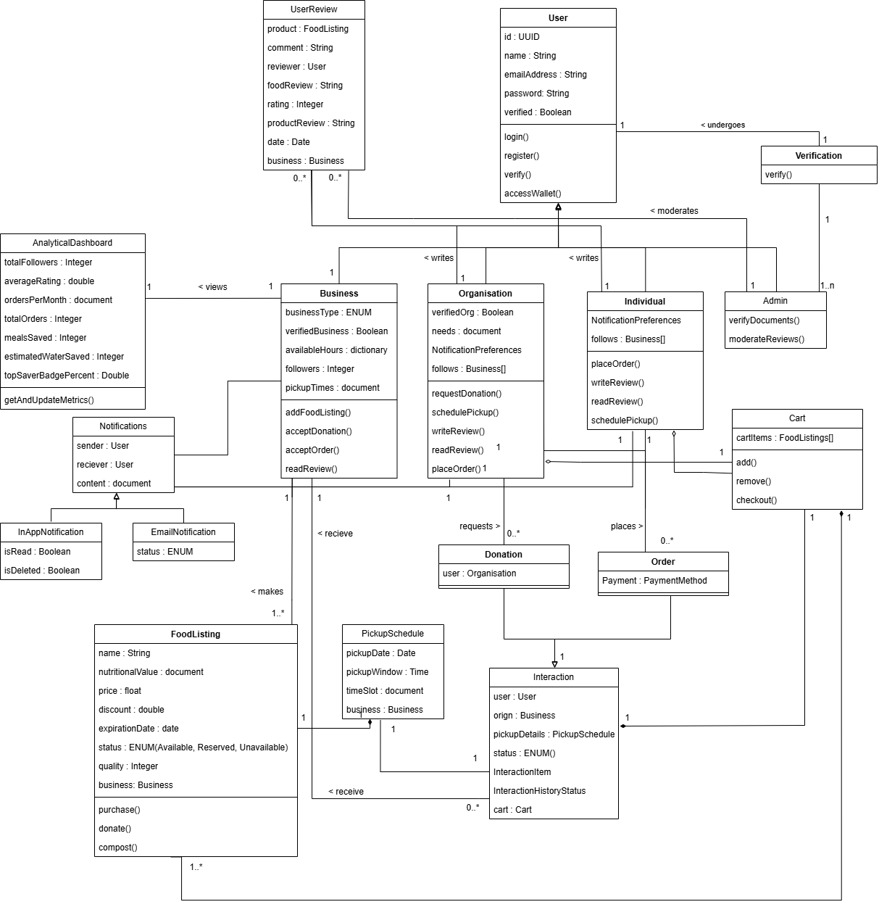

# Software Requirements Specification (SRS)  
**Project Name:** Save ‘n’ Bite  
**Version:** 1.0  
**Date:** [22/05/2025]  
**Team:** [Secure Web & Mobile Guild]  
**GitHub Repository:** [Link to Repo]  

---

## 1. Introduction  

### Business Need  
Food waste is a major global concern, with tons of surplus food being discarded every day despite being safe for consumption. This not only contributes to environmental harm but also overlooks the needs of food-insecure individuals and communities. Businesses such as restaurants, hotels, and grocery stores frequently dispose of edible surplus food due to logistical and regulatory constraints.  

Simultaneously, many individuals—especially students and low-income groups—face food insecurity. There is a need for a structured, secure, and accessible platform that facilitates the redistribution of surplus food in a way that is efficient, compliant with safety regulations, and scalable across communities.  

### Project Scope  
Save ‘n’ Bite will develop a web and mobile platform that connects food suppliers with individuals and organisations in need. The system will allow verified users to list, browse, request, purchase, or request a donation of surplus food. It includes:  
- Role-based dashboards  
- Scheduling tools for pickups  
- AI-driven listing suggestions  
- Review features  

**Exclusions:**  
- Delivery and logistics are **not** part of this project.  

**Pilot Program:**  
The project will be piloted with **University of Pretoria food outlets** in collaboration with **Gendac**.  

---

## 2. User Stories / Epics 

### EPIC 1: User Profile Management  

| User Stories | Acceptance Criteria |
|-------------|--------------------|
| **1. As a Food Provider**, I want to register a profile so that I can list surplus food items for sale or donation. | Given that a user wants to register as a Food Provider, when they select "Register as Food Provider" and enter business details, contact information, and license documents, then a confirmation of successful registration is received. |
| **2. As an Individual Consumer**, I want to register an account so that I can browse and purchase food. | Given that an Individual Consumer wants to register an account, when they choose "Register as Individual" and provide their name, email, and password, then a confirmation email is sent upon successful registration. |
| **3. As an Organization**, I want to register to request food donations for our cause. | Given that an Organization wants to register for food donation requests, when they select "Register as Organization" and upload proof of registration, then their status is set to "Verification pending" until approved by an admin. |
| **4. As a System Administrator**, I want to verify user accounts so that only legitimate providers and organizations are approved. | Given that a System Administrator wants to verify user accounts, when they access the admin dashboard and review uploaded documents, then they can approve or reject users with comments. |
| **5. As any User**, I want to update my profile information so that I can keep my data current. | Given that a user wants to update their profile information, when they edit fields such as email, phone, profile image, and upload updated documents, then their profile information is updated accordingly. |
| **6. As a System Administrator**, I want to manage user roles and permissions so that appropriate access is granted to each user type. | Given that a System Administrator wants to manage user roles and permissions, when they access role management features, then they can assign roles and restrict access based on the selected role. |

### EPIC 2: Food Listing and Management  

| User Stories | Acceptance Criteria |
|-------------|--------------------|
| **1. As a Food Provider**, I want to create a food listing so that surplus food can be made available. | Given that a Food Provider wants to list surplus food, when they enter the food name, description, expiration date, and optionally upload images and choose a pickup/delivery method, then the food listing is created as either a donation or discount item. |
| **2. As a Food Provider**, I want to receive AI-based listing suggestions so that I can optimize sales and reduce waste. | Given that a Food Provider is creating or updating a listing, when they input relevant details, then the system suggests optimal listing time and quantity based on historical data. |
| **3. As a Food Provider**, I want to view and manage my own listings so that I can update or remove them as needed. | Given that a Food Provider wants to manage existing listings, when they access their dashboard, then they can view, edit, or delete current and past food items. |

### EPIC 3: Food Discovery  

| User Stories | Acceptance Criteria |
|-------------|--------------------|
| **1. As an Individual Consumer**, I want to search for food items so that I can find meals that meet my needs. | Given that an Individual Consumer is searching for food, when they use the search bar and apply filters by name, type, expiration date, or location, then relevant food items are displayed. |
| **2. As an Organization**, I want to browse food listings so that I can find donations suitable for our needs. | Given that an Organization is browsing for food donations, when they filter listings by type, quantity, or expiration date, then donation-only items relevant to their needs are shown. |
| **3. As any User**, I want to view food details so that I can make informed decisions. | Given that any User is viewing a food listing, when they select an item, then the full details including description, images, listing date, and provider details are visible. |
| **4. As any User**, I want to receive notifications about new listings so that I can act quickly. | Given that any User has enabled notifications, when new listings that match their preferences (e.g., category or area) are posted, then they receive email or in-app alerts. |

### EPIC 4: Transactions & Donations 

| User Stories | Acceptance Criteria |
|-------------|--------------------|
| **1. As an Individual Consumer**, I want to purchase discounted food items so that I can reduce my food cost. | Given that an Individual Consumer is ready to make a purchase, when they proceed to checkout and complete the payment, then they can review their final order before payment confirmation. |
| **2. As an Organization**, I want to request food donations so that we can support those in need. | Given that an Organization wants to request a donation, when they submit a request for a specific donation listing, then they receive confirmation and available delivery options. |
| **3. As any User**, I want to view my transaction history so that I can track my past activities. | Given that any User wants to review their past transactions, when they access their transaction history, then they can filter by date and type (purchase/donation) and view order details and statuses. |

### EPIC 5: Pickup Coordination

| User Stories | Acceptance Criteria |
|-------------|--------------------|
| **1. As an Individual Consumer**, I want to schedule a pickup so that I can collect food at a convenient time. | Given that an Individual Consumer is finalizing a request or purchase, when they select a pickup time slot, then they receive pickup location, contact information, and a confirmation/reminder notification. |
| **2. As a Food Provider**, I want to manage pickup schedules so that I can prepare the food ahead of collection times. | Given that a Food Provider wants to prepare for pickups, when they define pickup windows and view the upcoming schedule, then they can manage pickups and mark them as completed when done. |
| **3. As a System Administrator**, I want to view and monitor all scheduled pickups so that I can ensure operations run smoothly. | Given that a System Administrator wants to monitor pickup activities, when they view the admin dashboard, then they can see all pickups, filter by user or time, and edit pickup times if needed. |

### EPIC 6: Feedback & Reviews

| User Stories | Acceptance Criteria |
|-------------|--------------------|
| **1. As an Individual Consumer**, I want to rate my purchase experience so that I can give feedback. | Given that an Individual Consumer has completed a transaction, when they leave a review with a rating and optional comment, then the review is linked to the specific transaction. |
| **2. As a System Administrator**, I want to moderate reviews so that we ensure quality content. | Given that a System Administrator wants to moderate user feedback, when they access the reviews section in the dashboard, then they can remove or flag inappropriate content. |

### EPIC 7: Analytics & Impact Tracking

| User Stories | Acceptance Criteria |
|-------------|--------------------|
| **1. As a Food Provider**, I want to view waste reduction metrics so that I can measure our sustainability efforts. | Given that a Food Provider wants to assess their environmental contribution, when they view analytics, then they see metrics such as food saved and CO₂ reduction over time (monthly/yearly). |
| **2. As an Organisation**, I want to track meals received and distributed so that we can report impact to donors. | Given that an Organization needs to track its operational impact, when they access reports, then they see visual charts of meals received and can export the data for reporting purposes. |

### EPIC 8: Blockchain & Rewards System

| User Stories | Acceptance Criteria |
|-------------|--------------------|
| **1. As an Individual Consumer**, I want to earn SaveCoins for sustainable actions so that I feel rewarded | Given that an Individual Consumer performs sustainable actions (e.g., donations or purchases), when the action is completed, then SaveCoins are automatically awarded and the balance updates in real-time. |
| **2. As an Organisation**, I want to redeem rewards so that we can access useful resources or discounts. | Given that an Organization has accumulated SaveCoins, when they view the reward catalog, then they can redeem coins for eligible resources or discounts. |

### EPIC 9: Education & Community

| User Stories | Acceptance Criteria |
|-------------|--------------------|
| **1. As any User**, I want to view sustainability content so that I can learn how to reduce food waste. | Given that any User wants to learn about sustainability, when they browse the education section, then they can view articles, videos, infographics, and track completed content. |
| **2. As an Individual Consumer**, I want to participate in challenges so that I can stay motivated. | Given that an Individual Consumer wants to stay motivated, when they join a sustainability challenge, then they receive progress updates and badges as they complete activities. |

### EPIC 10: Gamification

| User Stories | Acceptance Criteria |
|-------------|--------------------|
| **1. As a Food Provider**,  I want to earn points for listing items regularly so that I feel recognized. | Given that a Food Provider lists items regularly, when new listings or transactions are completed, then points are awarded and progress toward achievements is visible. |
| **2. As any User**, I want to view a leaderboard so that I can compare my sustainability impact with others. | Given that any User wants to track their standing, when they view the leaderboard, then they see rankings categorized by user type (individuals, providers, organizations) with weekly and monthly summaries. |

---

## 3. Use Case Diagrams  

 *(Upload a PNG/PDF to your repo and link it here.)*  

---

## 4. Functional Requirements  

R1: **User Management**
    R1.1 The system must support registration for individuals. organisations, and businesses.
    R1.2 Users must be verified during registration.
    R1.3 The system must support role-based access (e.g. individuals, organisations, businesses, admin).
    R1.4 Secure login/logout functionality must be provided.
    R1.5 The system must limit functionality based on user role and verification status.
    R1.6 The system should allow the user to update their profile.
    R1.7 The system should allow the user to reset their password.
    R1.8 The admin should be able to manage roles and permissions. 

R2: **Make Listings**
    R2.1 Only verified business users should be able to create new surplus food listings.
    R2.2 Each listing must include the following details:
        -Name of the item
        -Description
        -Expiry date
        -Photos (optional)
        -Quantity available
        -Price (or mark as donation)
        -Pickup Options
    R2.3 Business users should be able to indicate whether the listing is for sale at a discounted price or available as a donation.
    R2.4 Listings should update real-time availability as items are reserved or claimed.
    R2.5 Businesses should be able to update food listings.
    R2.6 Businesses should be able to view their own listings.

R3: **Browse Listings**
    R3.1 Verified users (individuals and organizations) should be able to view active food listings.
    R3.2 Users should be able to search for listings by keyword (e.g., name, category).
    R3.3 Users should be able to filter listings by:
        -Availability (in stock)
        -Type (donation or discounted sale)
        -Expiry date
        -Business location
    R3.4 Listings should display clearly formatted information (e.g., name, expiry, image, availability).
    R3.5 Users should be able to sort the listings.
    R3.6 Users should be able to receive notifications whenever new listings are added for food products they’re interested in.
R4: **Purchase / Request Food Items**
    R4.1 Verified individual users should be able to purchase discounted food items.
    R4.2 Verified organization users should be able to request food items listed as donations.
    R4.3 The system should enforce limits to prevent bulk purchasing or hoarding (based on user role and verification status).
    R4.4 Upon purchase or request, the listing should be updated to reflect new availability.
    R4.5 A confirmation screen should summarize the transaction (e.g., pickup time, location, item details).
    R4.6 Users should be able to cancel purchases if they haven’t paid for them yet.
    R4.7 Users should be able to view their transaction history.
R5: **Logistics**
    R5.1 Businesses must be able to set available pickup times for each listing.
    R5.2 Organizations must be able to coordinate logistics for food pickups.
    R5.3 Real-time tracking and status updates must be available for scheduled pickups.
    R5.4 The system should allow users to receive notifications about pickup schedules and updates.
R6: **Feedback & Review**
    R6.1 Verified users must be able to rate their food purchase or donation experiences.
    R6.2 Businesses must be able to view feedback received.
    R6.3 A moderation system must exist to prevent false or abusive reviews.
    R6.4 Reviews should be linked to specific listings or transactions.
R7: **Analytics**
    R7.1 Businesses must be able to view analytics on food waste reduction (e.g., items saved).
    R7.2 The system should present user-friendly dashboards for performance metrics (e.g., total meals donated).
    R7.3 Metrics may include total donations, frequent users, and overall impact.
R8: **AI Prediction**
    R8.1 The system must use historical data to predict surplus food trends (e.g., "Fridays have 20% more leftovers").
    R8.2 AI must suggest optimal listing times or donation windows to maximize redistribution.
    R8.3 Predictions must be visible to business users during listing creation.
    R8.4 The system must generate smart recommendations to organisations and individuals.
R9. **Blockchain & Rewards**
    R9.1 The platform must include a blockchain-based wallet system for secure transactions.
    R9.2 Users should be able to earn rewards for actions like donations, purchases, or community engagement.
    R9.3 Rewards and transactions must be logged securely and transparently on the blockchain.
    R9.4 Users may redeem rewards for discounts or other incentives.
    R9.5 Individuals and organisations should be able to share their impact achievements.
R10: **Educational & Community**
    R10.1 The platform must include educational content on reducing food waste.
    R10.2 The platform should allow users to participate in sustainability challenges.
    R10.3 Users must be able to access community updates, initiatives, or campaigns.
R11: **Gamification**
    R11.1 Users must be able to earn badges based on activity (e.g., “5 meals saved this week”).
    R11.2 The platform must support social sharing of achievements (e.g., on X/Twitter or Instagram).
    R11.3 Badges should be linked to real impact data (e.g., CO₂ reduction, meals saved).
    R11.4 A leaderboard or achievement dashboard should be available for user motivation.

---

## 5. Service Contracts  

*(Coming Soon – Describe API endpoints, request/response formats, etc.)*  

---

## 6. Domain Model  

---

## 7. Architectural Requirements  

### 7.1 Quality Requirements  
*(E.g., Performance, Scalability, Security – To be filled later.)*  

### 7.2 Architectural Patterns  
*(E.g., MVC, Microservices – To be filled later.)*  

### 7.3 Design Patterns  
*(E.g., Singleton, Observer – To be filled later.)*  

### 7.4 Constraints  
*(E.g., Compliance with food safety laws, limited to web/mobile – To be filled later.)*  

---

## 8. Technology Requirements  

*(Coming Soon – List programming languages, frameworks, databases, etc.)*  

---

**Notes:**  
- Replace placeholder images with actual files.  
- Update sections marked "Coming Soon" as progress is made.  
- Ensure consistency with your team’s GitHub documentation standards.  